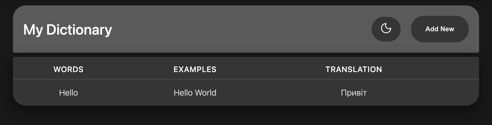

# My Dictionary

A vocabulary tracker for language learners. Store words with translations 
and example sentences.



## Stack

- Frontend: HTML, CSS, JavaScript
- Backend: Node.js + Express *(in progress)*
- Database: SQLite *(in progress)*

## Features

- Add, edit, delete words
- Dark mode
- localStorage *(temporary — migrating to SQLite)*

## Roadmap

- REST API with Node.js + Express
- SQLite database
- Word categories and sorting

## Run Locally

```bash
git clone https://github.com/emikatop/my-dictionary.git
cd my-dictionary
open index.html
```